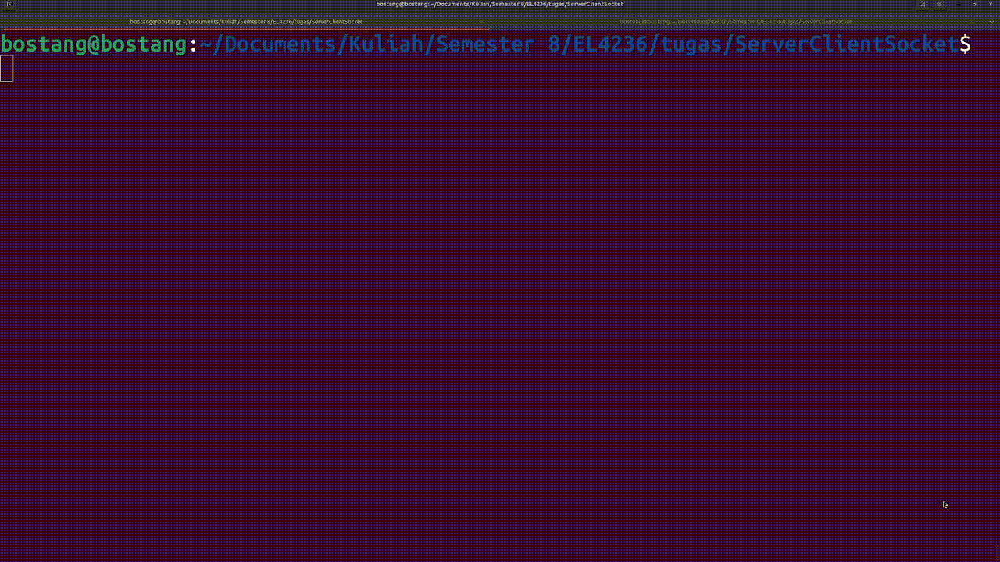

# ServerClientSocket

Melakukan komunikasi antara server dan client menggunakan pemrograman soket.

Anggota :

1. Bostang Palaguna (13220055)
2. Karma Kunga (13220028)

## Perintah

Buatlah simulasi komunikasi antara _client_ dengan _server_ dengan pemrograman socket. Antara _client_ dan _server_ dibuat dengan bahasa pemrograman yang berbeda.

Contoh skenario:

```
Client : nama1
Server : Karma Kunga
Client : NIM1
Server : 13220028
Client : nama2
Server : Bostang Palaguna
Client : NIM2
Server : 13220055
Client : xyz
Server : Perintah tidak diketahui
Client : abc
Server : Perintah tidak diketahui
Client : Selesai
Memutus koneksi...
```

## Penjelasan

Dari sisi *server*, dibuat sebuah fungsi untuk meng-handle komunikasi `func()`. Server akan menerima pesan dari client yang disimpan ke sebuah *buffer* `buff` dengan perintah

```C++
read(connfd,buff,sizeof(buff));
```

Setelah itu server akan mengisi ulang `buff` sesuai dengan isi `buff` (hasil pesan dari *client*) lalu mengirimkannya kembali ke *client*.

```C++
if (strncmp("...",buff,5) ==0){
	strcpy(buff,...);
}
else if ...
...
else ...

write(connfd,buff,sizeof(buff));
```

Dari sisi *client*, dibuat sebuah fungsi untuk meng-handle komunikasi `handle_connection()`. Fungsi ini akan 

Client akan mengirimkan pesan ke server dengan perintah

```python
data = input("Client: ").encode()
sockfd.sendall(data)
```

lalu *client* juga akan menampilkan hasil pesan dari `server` yang disimpan pada `buff`. Apabila `buff` berisi kata ***selesai***, maka *client* akan memutus koneksi dengan *server* (`break`).

```python
response = sockfd.recv(MAX_BUFFER_SIZE).decode()
if response !="selesai":
	print("Server:", response)
if response.startswith("selesai"):
	print("Memutus koneksi...")
	break
```


## Demonstrasi

Berikut adalah demonstrasi dari komunikasi *point-to-point* antara server (C) dengan sebuah client (python).


